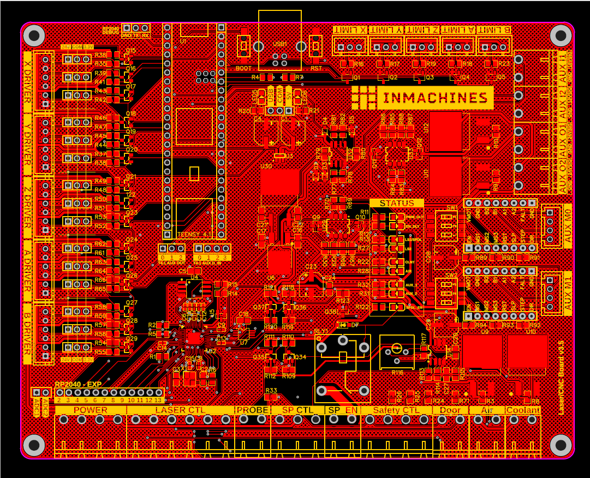
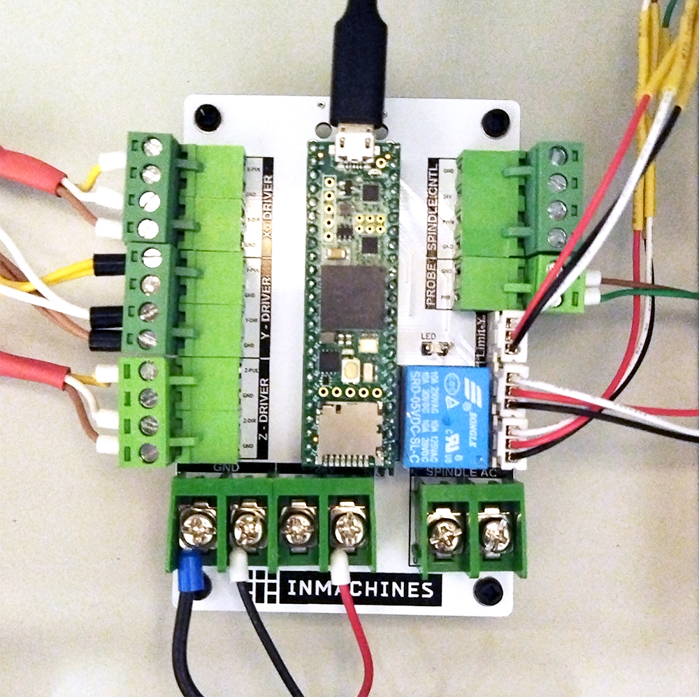
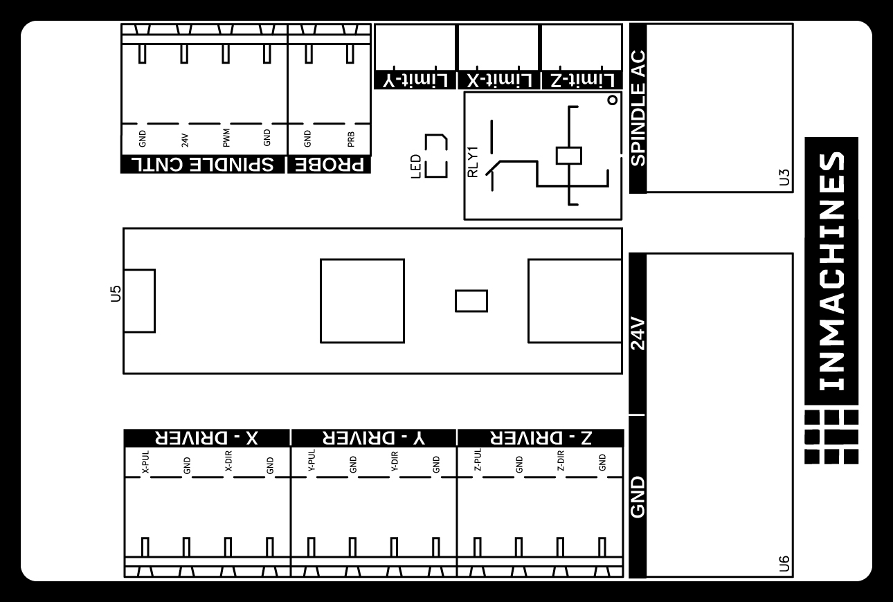
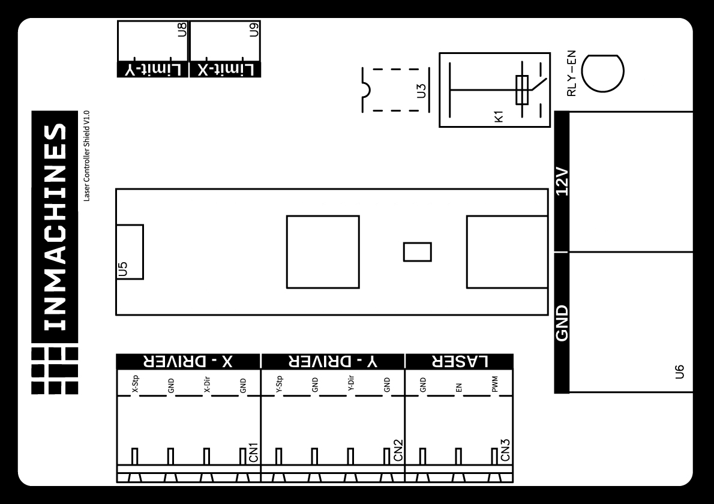
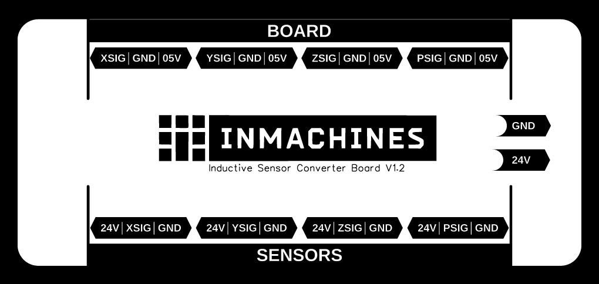
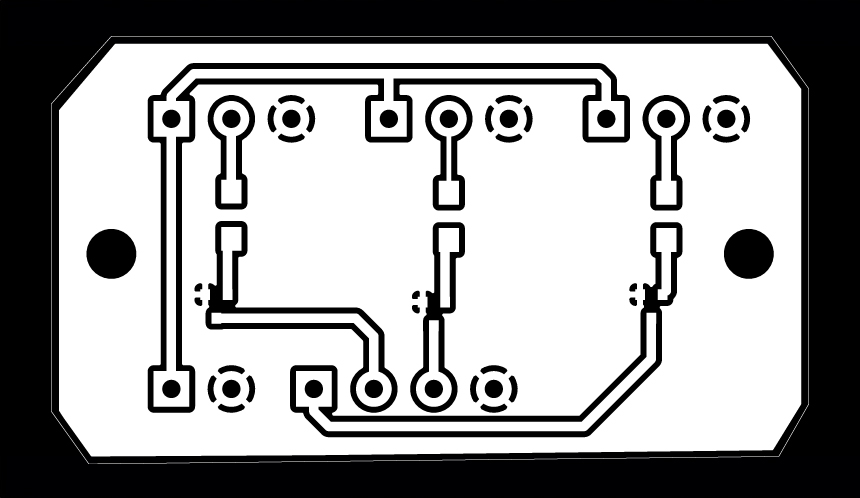
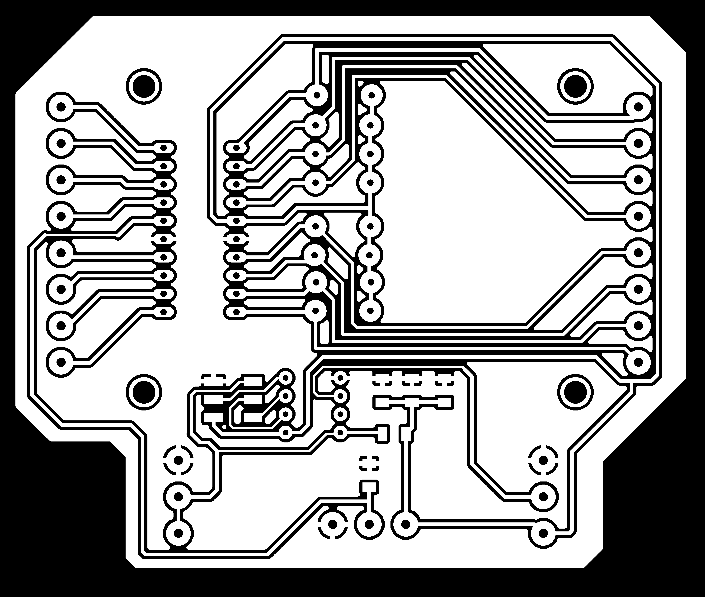

<h1 style=align="center">OLSK Electronics</h1>

<i>Open Source PCBs for OLSK Machines</i>

 

Introduction
--
Most of the OLSK machines use a custom PCB which fits the machine's needs. Here you can find the documentation for each board.

Main Boards
--

**[OLSK Laser CNC Board V3.5](Laser_CNC_Board_V3-5)**

Main board used in **[OLSK Small CNC V2](https://github.com/Open-Lab-Starter-Kit/OLSK-Small-CNC)**.

 
   

**[OLSK CNC Mill Controller Shield V1.5](CNC_Mill_Controller_Shield_V1-5)**

Main board used in **[OLSK Large CNC V1](https://github.com/Open-Lab-Starter-Kit/OLSK-Large-CNC)**.

 
   

**[OLSK Laser Controller Shield V1.0](Laser_Controller_Shield_V1-0)**

Main board used in **[OLSK Large Laser V1](https://github.com/Open-Lab-Starter-Kit/OLSK-Large-Laser)**.

 
   

Converter Boards
--

**[Inductive_Sensor_Converter_Board_V1-2](Inductive_Sensor_Converter_Board_V1-2)**

Inductive sensor converter board used in **[OLSK Large 3D Printer V1](https://github.com/Open-Lab-Starter-Kit/OLSK-Large-3D-Printer)** and **[OLSK Small 3D Printer V1](https://github.com/Open-Lab-Starter-Kit/OLSK-Small-3D-Printer/tree/main/OLSK_Small_3D_Printer_V1)**.

 
   

**[Probe Converter Small CNC V1](Probe_Converter_Small_CNC_V1)**

Inductive sensor converter board used in **[OLSK Small CNC V1](https://github.com/Open-Lab-Starter-Kit/OLSK-Small-CNC/tree/main/OLSK_Small_CNC_V1)**.

 
   

**[Fabulaser Mini V2 Converter PCB](Fabulaser_Mini_V2_Converter_PCB)**

Converter board used in **[OLSK Small Laser V1](https://github.com/Open-Lab-Starter-Kit/OLSK-Small-Laser/tree/main/OLSK_Small_Laser_V1)**.

 
  <be>

License
--

Hardware design, CAD and PCB files, BOM, settings and other technical or design files are released under the following license:

- CERN Open Hardware Licence Version 2 Weakly Reciprocal - **[CERN-OHL-W](LICENSE_CERN_OHL_W_V2.txt)**

Assembly manual, pictures, videos, presentations, description text and other type of media are released under the following license:

- Creative-Commons-Attribution-ShareAlike 4.0 International - **[CC BY-SA 4.0](LICENSE_CC_BY_SA_4.0.txt)**

